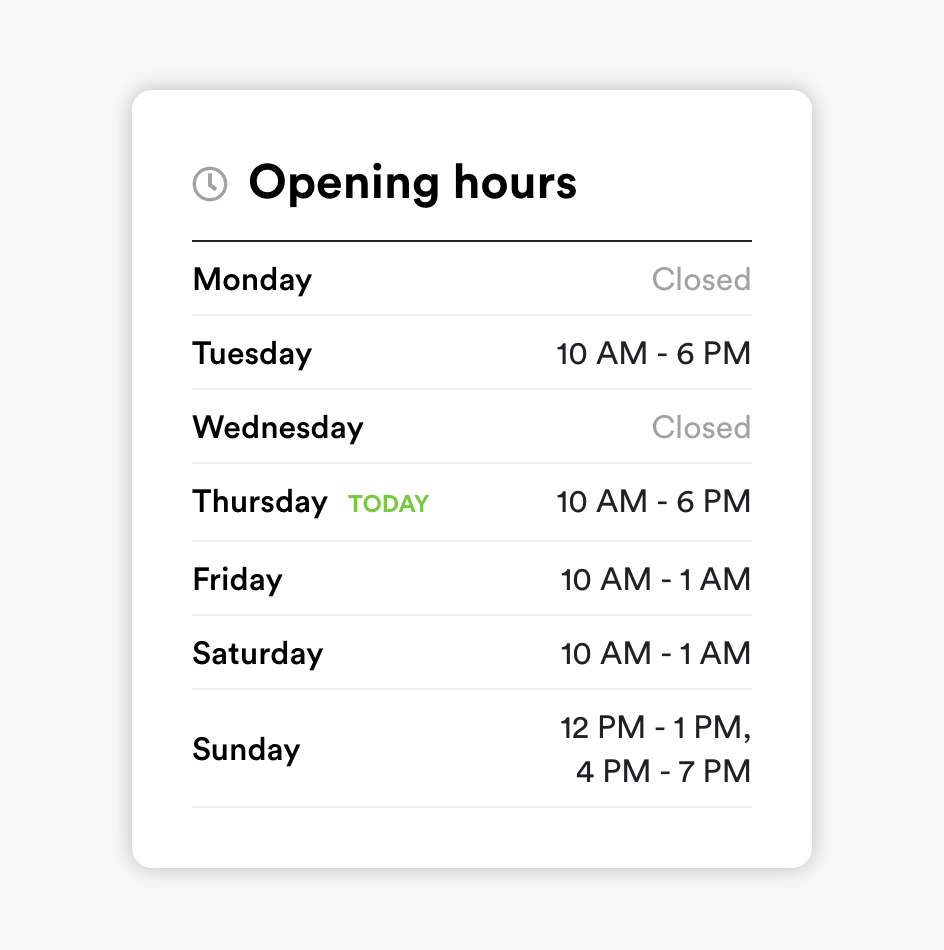

# Restaurant Opening Hours
> Let's show the hours in the right way!

The project is a Front-end assignment to read a restaurant's opening hours from a JSON files and displaying them nicely according the provided design.

The website is live at [https://restaurant-opening-hours.herokuapp.com/](https://restaurant-opening-hours.herokuapp.com/)




## Installation

```sh
npm install
```

## Development setup

By default input.json is used as the source of the data. To try different values, you need to change its contents.

```sh
npm test
npm start
```

## Shortcomings

The styles could be organized and done in a more efficient, and more scalable manner. The tests are done merely to demonstrate the possibility of doing different types of testing. 
